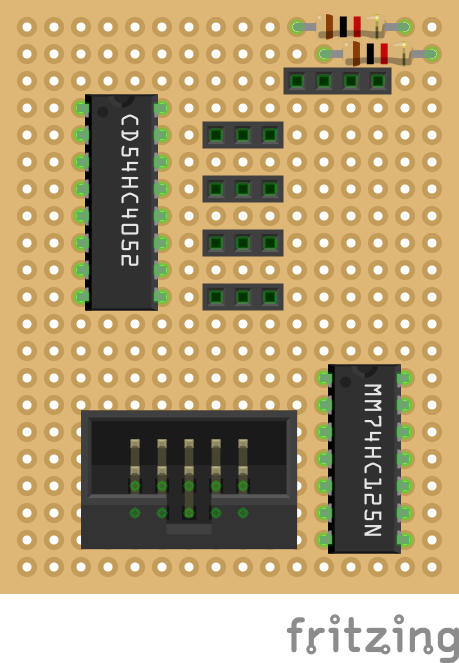
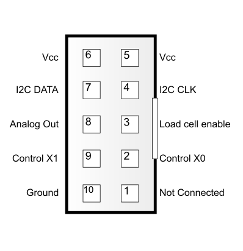

# README In Progress...

# Save the bees! A 6loWPAN approach

## Introduction

This repository contains the code and libraries used for [Save the bees](https://github.com/save-the-bees). This project includes monitoring the ambient conditions and status of distant beehives on the field. The data can be visualized and be accessible worldwide through a cloud service. The current implementation aims at using constrained devices with priority to low energy protocols regarding radio communication and hardware management.   

## Architecture

This implemantation is based on low energy **802.15.4** standard and is using **6loWPAN** adaptation layer in order to embrace **IPv6** addressing and meshing routing protocols. That makes it ideal for use in remote areas with limited resources, in terms of power and connectivity. On the application layer, the nodes use the **CoAP** protocol, which is really useful when coming to constrained devices. The demo follows a *client-server* approach, with the beehives acting as servers (and also creating a mesh netwrok). The clients can reside on computational stronger hosts (e.g. a RPi). The client is responsible to run a user defined script in order to poll the beehives and gather data. Then, the same script uploads the data to the cloud using a suiting protocol (such as **http** or **mqtt**).

One of the primary targets of the project is taking advantage of the constrained device and their low energy needs. Using the above architecture we can run the devices for months on rechargable batteries. More specifically the below diagram shows the great power efficiency we get, using MAC protocols (contikimac) which keep the radio off most of the time. In addition to that, integrated circuits make it possible to deactivate sensors during inactivity periods thus saving more energy. A deep-sleep approach is not implemented on this demo but users are free to experiment! 


## Requirements
### Hardware
* Zolertia [Remote](https://github.com/Zolertia/Resources/wiki/RE-Mote) or [Firefly](https://github.com/Zolertia/Resources/wiki/Firefly) board.
* [AM 2315](https://cdn-shop.adafruit.com/datasheets/AM2315.pdf) I2C humidity/temperature sensor.  
* 4 x [FC 2231](http://www.mouser.com/ds/2/418/FC22-710299.pdf) load cell sensors. 
* [MM74HC125N](http://www.mouser.de/ProductDetail/Fairchild-Semiconductor/MM74HC125N/?qs=BcFB%2f8l%252bKIqgOjOHKDdfgw==) tri-state buffer. (optional for energy saving)
* [CD74HC4052](http://www.ti.com/product/CD74HC4052/datasheet) multiplexer.

*The current code is designed for zolertia Remote motes. Changes may be necessary in order to use the Firefly mote.*

### Software
* A **6loWPAN gateway**. This will be the link to the IPv4 world. It encorporates a border-router to communicate with 6loWPAN motes and a proxy-server to receive and forward CoAP requests. This is where the script will be run. Analytic installation steps can be found [here]().
* **ContikiOS** tools and libraries, in order to flash the beehive nodes. [Here](https://github.com/Zolertia/Resources/wiki/Toolchain-and-tools) you can find more information for installation.
* [relayr Dashboard](https://dev.relayr.io) account.

## Hardware setup

In that step we must interconnect all the components so we get a working prototype. The I2C sensor is directly connected to respective pins of the zolertia Remote. The load cells, which are more energy consuming (around 20mA combined) are connected to the ICs. 

The analog output lines of the sensors are multiplexed through the CD54HC4052 multiplexer: Following the [datasheet](https://github.com/Zolertia/Resources/wiki/RE-Mote) we connect the 2 control signals (X0,X1) to pins **PB6** and **PB7** of the Remote board, and the analog input to the **ADC1** pin. We also connect Vcc, Gnd and the sensors outputs to the respective pins.

The power lines of the sensors are connected to the MM74HC125N tri-state buffer. According to the datasheet, we short-circuit all the enable signals with Remote's **PC6** pin. Also, short-circuit all the tri-state inputs to Vcc. In that way, we can enable or disable power to our sensors. On the tri-state outputs, we connect the respective Vcc lines of the sensors. Notice that the pre-mentioned IC uses negative enables.

In our case, these components were connected to a prototyping board in order to gain easier connectivity and access by more devices. Below you can find a [fritzing](http://fritzing.org) diagram and the labels for the shrouded connector used. 




## Beehive Server
The client running on the beehive mote. The mote is responsible for tracking information such as the internal/external temperature & humidity, as well as the current weight of the beehive. The beehives create a mesh network using a sub-GHz frequency radio. The ones closer to the border-router communicate directly and forward traffic from and to distant beehives. Through the border-router (6loWPAN gateway), the data are uploaded to a cloud service.

### Setting up
* Radio settings:  
The motes can work both in 2.4 GHz and Sub-GHz frequencies. This can be changed from the configuration header ```project-conf.c```, by (un)defining ```CC1200_CONF_SUBGHZ_50KBPS_MODE```.

* Sensor settings:  
The humidity/temperature sensors are calibrated from the box and need no further adjustment.  
The load cells must be calibrated due to the fact that we use four of them and usually the sensing values are not identical for the same weight. The constants used for converting to grams can be set through the ```fc2231.h``` file, by defining ```FC2231_CONSTANT``` and ```FC2231_SLOPE``` constants. More info on how to calculate these values can be found in the **Calibrating** section below.

### Compiling
1. Plug in the Zolertia mote.
2. Go to the ```beehive/``` directory. 
3. Execute:

	```shell 
	$make TARGET=zoul bee-server.upload
	```	
4. The mote is ready to deploy!


### Calibrating
The values reported here are pre-calculated and defined. Slight changes between various cells can be found though, so here is a quick guide on calibrating the sensors:  
The load sensors give out a voltage linear to the weight applied on them. That means that the weight-voltage diagram is a straight line and therefore can be calculated using a slope and a constant value. In order to get these values we need two points (aka two known weights) on the plot. A quick reminder of calculating the straight line from two given points can be found [here](https://en.wikipedia.org/wiki/Linear_equation) and an [online tool](http://www.mathportal.org/calculators/analytic-geometry/two-point-form-calculator.php) to do so. The steps for calibrating are:  

1. In the ```dev/fc2231.c``` enable ```DEBUG 1```.
2. Flash the new version by executing 
	
	```shell
	$make TARGET=zoul bee-server.upload
	```
3. From the ```beehive/``` directory execute:

	```shell
	$make TARGET=zoul login
	```
	That will give access to serial debugging console.
4. Press the user button on the Remote board to tare the scale. Now write down the voltage value you get from **one** sensor, as seen on the debug console.
5. Put a known weight on the cell. Write down the sensor reading once more.
6. Now you have the two points needed. For example if you put 0 and 1 Kg respectively: (1,3445), (0,4567). Calculate the straight line slope and constant. 
7. Change the ```cf2231.h``` constants: ```FC2231_SLOPE``` and ```FC2231_CONSTANT```.
8. Flash the code again and you are ready to go!  

*Note that ideally all the sensors are the same or really close in their outputs. If that is not the case you will be off for a few gramms*

### Tracking
1. Copy the python script and settings files to the host machine.
2. Set the values and parameters in the setting file:
	* ```OPERATION```: Refers to CoAP operation. Set to ```GET```
	* ```PATH```: the node's IPv6 address and port. For example: ```coap://[fd00::212:4b00:615:9fe2]:5683/```. **Important**: Do not forget the final slash ```/``` !
	* ```RESOURCE_PATH```: the resource specific path following the node adress. For example the humidity path for the specific example would be: ```HUM_PATH = sensors/am2315/humidity```
	* ```DEVICE_ID```: the ID you find in the device settings menu on the dashboard. 
	* ```USER_TOKEN```: the token you can find in the Account section of relayr dashboard.  
	**Important**: Exlude the ``Bearer`` part. 
3. Run the script in a shell, executing:
	
	```shell
	$python poll.py
	```
4. Open the dashboard and check that everything is up & running.


## References
* [ContikiOS](http://www.contiki-os.org).
* [relayr. dashboard](https://dev.relayr.io).
* More on [load cells](https://learn.sparkfun.com/tutorials/getting-started-with-load-cells)

##TODO

1. Adding more sensors to the beehive
2. Have a hollistic image of the current beehive condition
3. Visualize and aggregate data in a more sophisticated way